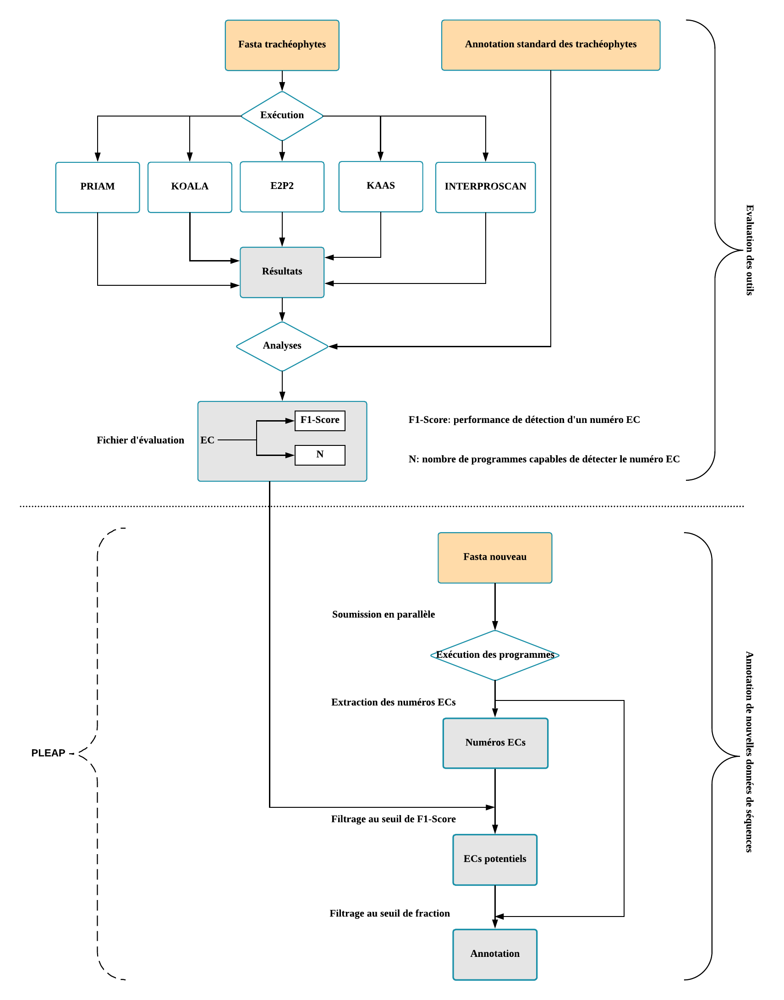

# Hassan-Kachalo Ali

Master 2 internship
--------------------

Period of [January ~ July] 2018 at Inra Toulouse
------------------------------------------------

## Annotation des enzymes chez les plantes à partir de plusieurs méthodes de prédiction

-------------------
### Dependencies
-------------------
[](https://opensource.org/licenses/MIT)

### 1. INTRODUCTION

Une fois l’assemblage du génome d’un organisme achevé, on se pose généralement 2 questions :
1. La répartition des gènes dans le genome ? S'agissant de l'Annotation structurale
2. La fonction de ces gènes ? Identification des protéines qu’ils codent s'agissant de l'Annotation fonctionnelle

Après la reponse aux questions posées, plusieurs analyses s'en suivent pour pouvoir bien interpreter les résultats. Mais la qualité de ces résultats depend de la qualité des annotations qui ont été faites. Cependant, ils existent en bioinformatique plusieurs outils permettant d'annoter de manière automatique les génomes nouvellement séquencés. La principale question qui a fait l'objet de ce stage est de savoir quels outils parmi ceux qui existent semblent les plus pertinents en terme d'annotation des séquences protéiques d'un génome nouvellement séquencé? Le problème posé est que les résultats d'annotation diffèrent d’un outil à un autre! Ainsi l'ojectif de ce stage est d'utiliser ces différentes sources d’annotation pour obtenir une prédiction qui semblera la plus fiable.

Missions:
1. Tests de comparaison des résultats des differents outils
2. Automatiser l’exécution de ces outils sur un même jeu de données
3. Concevoir des scripts R pour comparer et visualiser les differents résultats


-----------------
### 2. Principe:
On part d'un ensemble de séquences protéiques (Protéome) d'un organisme donné.

1. On exécute plusieurs programmes d'annotation automatique sur ce meme jeu de données
2. On compare les résultats ainsi obtenus.
3. On visualise les résultats pour l'interpretation.
4. Production d'une nouvelle annotation à partir des résultats obtenus.

----------------
### 3. Explication du code
#### runner.py
Le script __runner.py__ sert à lancer les programmes d'annotation que l'on souhaite comparer. Il prend en entrée un jeu de données d'un ensemble de séquences protéines au format fasta et plusieurs options permettant d'activer le ou les programmes que l'on souhaite exécuter en spécifiant pour cela le chemin d'accès à ces programmes. Il est de très simple utilisation. Pour lancer ce script, il faut disposer au préalable du jeu de données bien établit et de tous les chemins des programmes que l'on prevoit de soumettre.

Exemple: A supposer qu'on ait un dossier __m2Stage__ dans lequel se trouve le script __runner.py__, si vous souhaitez exécuter les programmes d'annotation tels que interproscan, E2P2 et PRIAM, alors je vous propose de suivre les étapes suivantes:
1. Interproscan se trouve sur le __nod cluster__ de LIPM, il faudrait donc avoir un compte sur nod. 
2. Connectez-vous à votre compte sur nod ensuite vous créez un dossier que vous allez nommer __m2Stage__ dans lequel vous ajouter le fichier __runner.py__ et __utils.py__.
3. 
	Suppons que le programme __E2P2__ est sur nod dans le dossier __m2Stage/third-party/E2P2/__. Pour info la drenière version de __E2P2__ se trouve à l'[adresse](https://dpb.carnegiescience.edu/labs/rhee-lab/software) du le site de Department of Plant Biology.
	Suppons que le programme [__PRIAM__](http://priam.prabi.fr/utilities/PRIAM_search.jar) et ses [__Releases__](http://priam.prabi.fr/REL_MAR15/Distribution.zip) sont sur nod dans le dossier __m2Stage/third-party/PRIAM/__. 
4. On peut maintenant tenter de lancer le script __runner.py__ comme suit:

```bash
	python runner.py -f inputFile.fasta --iprscan /usr/local/bioinfo/interproscan/interproscan.sh --priam third-party/PRIAM/PRIAM_search.jar,third-party/PRIAM/PRIAM_MAR15 --e2p2 third-party/E2P2/runE2P2.v3.1.py
```
>/usr/local/bioinfo/interproscan/interproscan.sh : est le chemin d'accès à interproscan sur nod

>third-party/PRIAM/PRIAM_search.jar : est le chemin d'accès au programme __PRIAM__ dans le cadre de cet exemple

>third-party/PRIAM/PRIAM_MAR15 : est le chemin d'accès au Releases de __PRIAM__ dans le cadre de cet exemple

>third-party/E2P2/runE2P2.v3.1.py : est le chemin d'accès au programme __E2P2__ dans le cadre de cet exemple 


--------------------
#### shinyApps/
Le dossier __shinyApps__ contient l'application shiny permetant de faire des analyses des numéros ECs de manière interactive. Ouvrez le secript __server.R__ et exécutez le en utilisant l'environnement Rstudio. Les fichiers à utilser pour tester cette application sont décris dans le README de ce dossier.


#### Rscripts/
Le dossier __Rscripts__ contient tous les scripts qui permettent de générer des graphics d'analyses. La description des scripts se trouve dans le README de ce dossier.


--------------------
### 4. Utilisation
#### Analyses du jeu de référence
1. Il faut disposer d'un jeu de données qui va servir de référence pour annotation.
2. Il faut l'exécuter sur des programmes de base choisis (programmes d'annotation à analyser). Vous obtiendrez des résultats d'annotation de ces differents programmes.
3. Chaque résultat doit être converti en un format commun. On dispose actuellement des convertisseurs pour les programmes (PRIAM, E2P2, Blast2Go, Interproscan, KASS, KOALA, PLEAP)
4. Les annotations originales de SwissProt possèdent un convertisseur aussi. Ce convertisseur est dans le même dossier que les convertisseurs des programmes cités en 3.)
5. On peut maintenant analyser ces résultats convertis avec le script __analyzer.py__. Comment l'exécuter ? (voire le README du dossier __analyzers__). Ce que l'on peut produire avec ce script: 

=> Les fichiers d'évaluation. Ces fichiers sont utilisés au niveau de l'application shiny dans l'onglet __"ECs Tab"__. Ils sont chargés et après on peut soumettre des réquêtes des numéros ECs.

=> Les fichiers des valeurs des sensibilités, des précisions, et des f1-scores qui vont permettre de construire des Heatmaps (Avec le script __heatmap.R__ qui se trouve dans le dossier __Rscripts__. Comment exécuter __heatmap.R__ ? Voire le README de __Rscripts__.)

#### Annotation du nouveau protéome
1. Il faut disposer du nouveau jeu de données et l'exécuter sur des programmes d'annotation de base choisis.
2. Il faut convertir les résultats récuperés avec les convertiseurs. Si vous ultilisez un programme qui n'a pas de convertisseur déjà codé, il va falloir regarder le resultat de ce programme et lui écrire un convertiseur en format commun avec les autres programmes.
3. On peut maintenant annoter le nouveau protéome avec __predictor.py__. Comment l'exécuter ? (voire le README du dossier __analyzers__). Ce que l'on peut produire avec ce script:

=> Les fichiers d'annotations selon le niveau choisi. 

=> Il y a une option a activer, si on le souhaite, pour produire les fichiers qui vont servir à la construction des courbes ROC des prédictions. Les courbes ROC sont construites avec le script __rocCurve.R__ du dossier __Rscripts__. Comment exécuter __rocCurve.R__ ? Voire le README de __Rscripts__.)

#### Application Shiny
Premet de produire des graphics de manière interactive et de faire des analyses  sur les numéros ECs en fonction des programmmes qui les prédits.
1. Pour construire le diagramme de venn et le upset avec Shiny, il faut d'abord produire les listes des numéros ECs prédits par programmes. Le script __get_ec_list.py__ du dossier __diverse__ permet de d'extraire la liste des numéros ECs prédits par un programme. Il prend en argument le fichier converti des résultats du programme; (Voire README du dossier __diverse__.)
2. Lorsqu'on a les listes des numéros ECs, on les charges dans Shiny avec le bouton "Add file". Chargez une liste, Indiquez le programme correspondant, vous verez le Diagramme de Venn et le UpSet se construire au fur et à mesure que vous continuez à charger d'autres liste des numéros ECs. Notice: Le diagramme de Venn s'arrête à partir de 5 listes de numéros ECs. Le UpSet lui il commence à se construire qu'à partir de la deuxième liste chargée. C'est à dire, le UpSet ne se construit pas avec une seule liste.
3. Comme préciser déjà, dans l'onglet  __"ECs Tab"__ de l'application, on utilise les fichiers d'évaluation pour faire des analyses sur les numéros ECs.
4. Dans l'onglet __"Heatmap"__ de l'application, je voudrai faire en sorte que le heatmap se construit au fur et à mesure que je charge les fichiers des valeurs des sensibilités, précisions et f1-scores. J'ai pas réussi à le faire. Une seule Heatmap peut se construire à la fois. 

